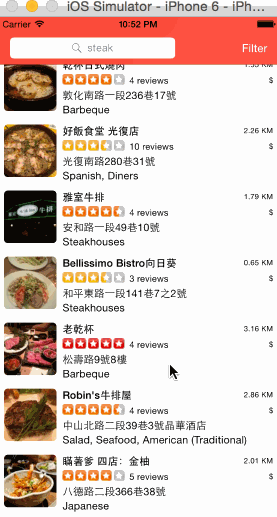

## Yelp

This is a Yelp search app using the [Yelp API](http://developer.rottentomatoes.com/docs/read/JSON).

Time spent: `<Number of hours spent>`

### Features

#### Required

- [v] Search results page
   - [v] Table rows should be dynamic height according to the content height
   - [v] Custom cells should have the proper Auto Layout constraints
   - [v] Search bar should be in the navigation bar (doesn't have to expand to show location like the real Yelp app does).
- [v] Filter page. Unfortunately, not all the filters are supported in the Yelp API.
   - [v] The filters you should actually have are: category, sort (best match, distance, highest rated), radius (meters), deals (on/off).
   - [v] The filters table should be organized into sections as in the mock.
   - [v] You can use the default UISwitch for on/off states. Optional: implement a custom switch
   - [v] Clicking on the "Search" button should dismiss the filters page and trigger the search w/ the new filter settings.
   - [v] Display some of the available Yelp categories (choose any 3-4 that you want).

#### Optional

- [v] Search results page
   - [v] Infinite scroll for restaurant results
   - [v] Implement map view of restaurant results
- [v] Filter page
   - [v] Radius filter should expand as in the real Yelp app
   - [v] Categories should show a subset of the full list with a "See All" row to expand. Category list is here: http://www.yelp.com/developers/documentation/category_list (Links to an external site.)
- [v] Implement the restaurant detail page.

### Walkthrough

Credits
---------
* [Yelp API Sample](https://github.com/Yelp/yelp-api/tree/master/v2/objective-c)
