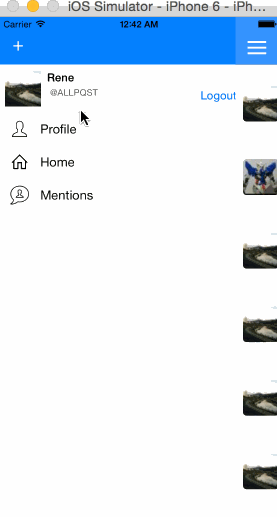

## Twitter Redux

This is an iOS demo application for twitter App Twitter API.

Time spent: 20 hours spent in total

Completed user stories:

Hamburger menu
- [x] Dragging anywhere in the view should reveal the menu.
- [x] The menu should include links to your profile, the home timeline, and the mentions view.
- [x] The menu can look similar to the LinkedIn menu below or feel free to take liberty with the UI.

Profile page
- [x] Contains the user header view
- [x] Contains a section with the users basic stats: # tweets, # following, # followers
- [ ] Optional: Implement the paging view for the user description.
- [ ] Optional: As the paging view moves, increase the opacity of the background screen. See the actual Twitter app for this effect
- [x] Optional: Pulling down the profile page should blur and resize the header image.

Home Timeline
- [x] Tapping on a user image should bring up that user's profile page

Account
- [x] Long press on tab bar to bring up Account view with animation
- [x] Tap account to switch to
- [x] Include a plus button to Add an Account
- [x] Swipe to delete an account
 
### Walkthrough

